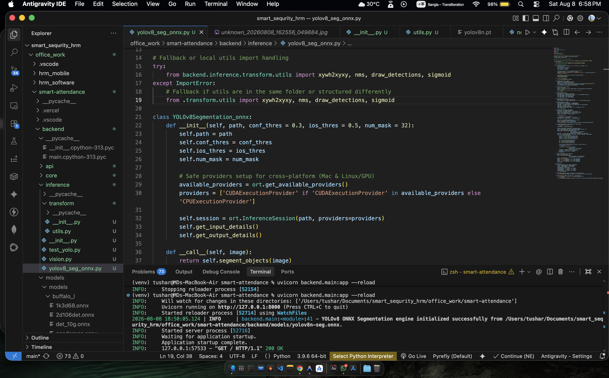

# 🎯 Smart Face Recognition Attendance System

> **A Full-Stack, Real-Time AI Face Recognition System** — Optimised for Apple Silicon (M1/M2/M3)
> 
> *Live Video Stream → InsightFace AI → FastAPI Backend → Next.js Frontend UI → Telegram Alerts*

---

## 🌟 Overview

The **Smart Face Recognition & Segmentation System** is an end-to-end Computer Vision application. It connects to a camera stream, processes frames locally using state-of-the-art AI (YOLOv8 Segmentation & InsightFace), and serves a real-time MJPEG video feed via a FastAPI backend.

---

## 📸 Inference Output
*(Save your screenshot as `output.jpg` in the root folder to display it here)*




---

## ✨ Key Features

- 🎥 **Live Stream & Detection**: Supports webcams and RTSP streams with real-time bounding boxes, class labels, and segmentation masks.
- 🎯 **YOLOv8 ONNX Segmentation**: Runs Ultralytics YOLOv8n-seg exported to ONNX format for blazing fast, cross-platform instance segmentation.
- 🧠 **Advanced AI Vision**: Built-in support for InsightFace `buffalo_l` embeddings for face recognition.
- 🏎️ **Hardware Acceleration**: Automatic fallback between CUDA (NVIDIA GPUs) and CPU providers via `onnxruntime`.
- ⚡ **FastAPI Streaming**: Streams processed frames via MJPEG using a highly concurrent, zero-latency generator.
- 💻 **Modern Web Dashboard**: A Next.js frontend to view the live camera feed and manage the system.
- 🗄️ **Local SQLite Database**: Async database operations via `aiosqlite`.

---

## 🛠️ Tech Stack

### Backend
* **Language:** Python 3.10+
* **Framework:** FastAPI & Asyncio
* **AI/CV:** YOLOv8-seg (ONNX Runtime), InsightFace, OpenCV, NumPy
* **Database:** aiosqlite (SQLite)
* **Messaging:** aiogram (Telegram Bot)

### Frontend
* **Framework:** Next.js (React 19)
* **Styling:** Tailwind CSS (v4), Lucide React Icons
* **API Comms:** native `fetch` with server-side proxying

---

## 📁 Project Structure

```text
smart-attendance/
├── backend/             # FastAPI backend application
│   ├── api/             # API routes and main entry points
│   ├── core/            # Configuration and database logic
│   ├── inference/       # Vision AI, YOLOv8, InsightFace models
│   ├── utils/           # Helper scripts (camera, notify, bot)
│   └── main.py          # Refactored FastAPI entry point
├── models/              # Local cache for AI models
├── snapshots/           # Local storage for captured face images
├── supabase/            # Supabase migrations and configurations
├── migrate_db.py        # Database migration script
├── package.json         # Root scripts (e.g., dev:all)
├── .env                 # Backend configuration secrets
│
└── frontend/            # Next.js Web Dashboard
    ├── app/             # Next.js App Router pages (Events, Persons, Settings)
    ├── components/      # Reusable UI components (Sidebar, Tables, Camera feed)
    ├── package.json     # Frontend dependencies & concurrently scripts
    └── .env.local       # Frontend environment variables
```

---

## 🚀 Getting Started

### 1. Prerequisites
- **Python 3.10+**
- **Node.js 18+** & npm
- (Optional) **ngrok** for Telegram webhooks

### 2. Backend Setup
```bash
# Navigate to the project root
cd smart-attendance

# Create and activate a virtual environment
python3 -m venv venv
source venv/bin/activate  # Windows: venv\Scripts\activate

# Install dependencies
pip install -r requirements.txt
```

### 3. Frontend Setup
```bash
# Navigate to the frontend directory
cd frontend

# Install Node dependencies
npm install

# Return to root
cd ..
```

### 4. Configuration

**Backend (`.env`)**
Create or edit `.env` in the root folder. See `.env.example` for all options.
```env
RTSP_URL=0                          # 0 for webcam, or rtsp://user:pass@ip:port/stream
FACE_MATCH_THRESHOLD=0.5            # Similarity cutoff (0.0 to 1.0)
TELEGRAM_BOT_TOKEN=your_token_here
TELEGRAM_ADMIN_ID=your_chat_id
TELEGRAM_WEBHOOK_URL=https://your-ngrok-url.ngrok-free.app
```

**Frontend (`frontend/.env.local`)**
Create `frontend/.env.local` to point the frontend to the backend API.
```env
NEXT_PUBLIC_API_URL=http://127.0.0.1:8000
```

### 5. Run the Full Stack
We've configured a single command that uses `concurrently` to launch both the FastAPI backend and the Next.js frontend simultaneously!

Make sure you are in the **project root** directory and run:
```bash
npm run dev:all
```
* **Frontend UI:** Open your browser to `http://localhost:3000`
* **Backend API Docs:** Available at `http://localhost:8000/docs`

> *Note: On the very first run, InsightFace will download its AI models (~400MB) into the `./models` directory. This may take a few minutes depending on your connection.*

---

## 📱 Telegram Admin Flow

The system features an interactive Telegram bot for handling unrecognized faces in real-time.

1. **Detection:** VisionEngine spots an "Unknown" face that passes quality and blur checks.
2. **Alert:** A snapshot is saved and sent to the Telegram Admin with inline buttons.
3. **Action:** Admin clicks **[✅ Add as Known]**.
4. **Registration:** The bot prompts for a name. The admin replies (e.g., "John Doe").
5. **Sync:** The database is updated, the embedding is saved, and the VisionEngine cache is hot-reloaded automatically. The system now recognizes John Doe!

---

## 🔧 Hyper-Parameter Tuning

If you experience flickering or slow detection, you can fine-tune the system in `.env`:

| Variable | Default | Description |
|---|---|---|
| `FACE_MATCH_THRESHOLD` | `0.5` | The tolerance for matching faces. Lower (e.g., 0.4) is stricter, higher (e.g., 0.6) is more forgiving. |
| `FACE_DETECT_THRESHOLD` | `0.5` | Minimum confidence score for the AI to consider a shape a face. |
| `UNKNOWN_COOLDOWN_SEC` | `120` | Seconds to wait before alerting about the *same* unknown person to prevent spam. |
| `FRAME_SKIP` | `4` | Processes every Nth frame. Higher = cooler CPU, Lower = smoother tracking. |
| `USE_YOLO_PREFILTER` | `True` | Run YOLOv8 person detection before face recognition to save processing power. |
| `AUTO_ENROLL_UNKNOWN_FACES`| `False` | Automatically save and learn unknown faces without manual Telegram approval. |

*(Advanced blur and bounding box size thresholds are configured directly in `main.py`).*

---

## 🐛 Troubleshooting

| Issue | Fix |
|---|---|
| **Cannot find `package.json` error** | Ensure you are running `npm run dev:all` from the *root* directory, not inside `frontend/`. |
| **No face detected / "Unknown" spam** | Check room lighting. Ensure the face is close enough to pass the 40x40px bounding box requirement. |
| **Telegram webhook failing (404)** | Your `TELEGRAM_WEBHOOK_URL` ngrok link has likely expired. Restart ngrok, update `.env`, and restart the backend. |
| **InsightFace Installation Errors** | Ensure you have a C++ compiler installed (e.g., Xcode Command Line Tools on Mac). |
